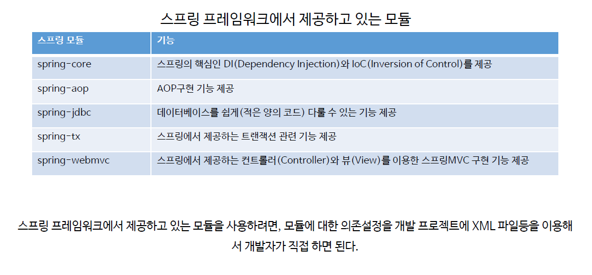
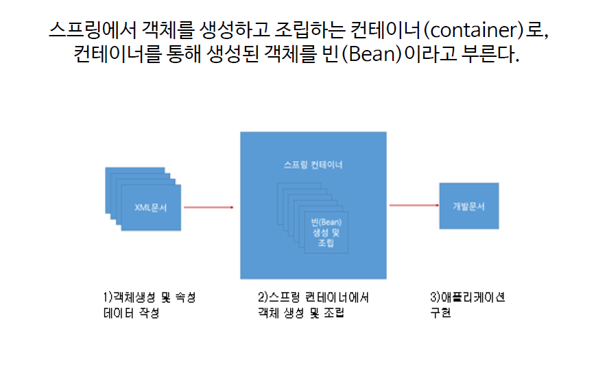

# ch1_Spring개요

1. 스프링 프레임워크

   * 스프링 프레임워크는 주요기능으로 DI, AOP, MVC, JDBC등을 제공한다.
     * DI : 어떤 기능을 만들어서 필요할 때마다 주입해서 사용하는 것
     * AOP : 관점지향 프로그래밍 = 주요부분만 작업하고 다른부분은 떼었다 붙였다 하는 프로그래밍
     * MVC : 모델, 뷰, 컨트롤러
     * JDBC : Java와 DB를 연결시켜주는 것 

   * 프레임워크는? 
     * 어떠한 수많은 기능을 추상화 시켜놓은 틀.
     * 그 안에서 필요한 기능을 틀 안에 구현하면 웹 애플리케이션을 빠르게 구현해 낼 수 있다.

2. 스프링 프레임워크 모듈

   

   * 필요한 모듈만 그때그때 사용하면 된다.
   * 필요없을 때는 언제든지 떼어내면 된다.

3. 스프링 컨테이너(IoC)
   

   * 1번에서 객체를 생성
   * 3번에서 필요할 때마다 스프링 컨테이너에서 꺼내서 사용함

