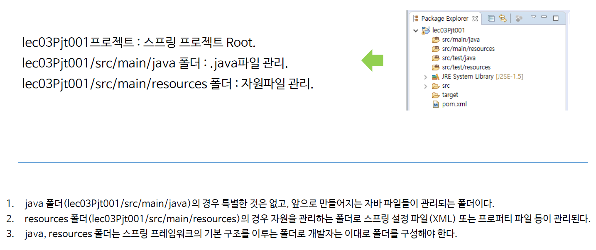
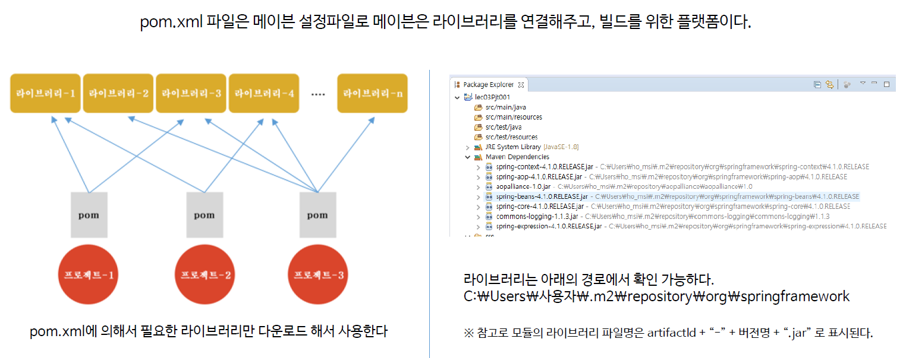

# ch03_makeSpringProject

### Maven을 이용해서 스프링프로젝트를 생성하는 방법에 대해 학습한다.

* maven = build tool이라고 생각하면 편하다.

* GroupID = 내가 사용하는 프로젝트 그룹의 id를 적어주는 것
* AspectID = 현재 해당하는 프로젝트

1. Project 설정

   * pom.xml 설정

     필요한 파일을 가져오기 위해 설정하는 것.

     다음과 같이 설정해준다.

   

2. 폴더 및 pom.xml 파일의 이해

