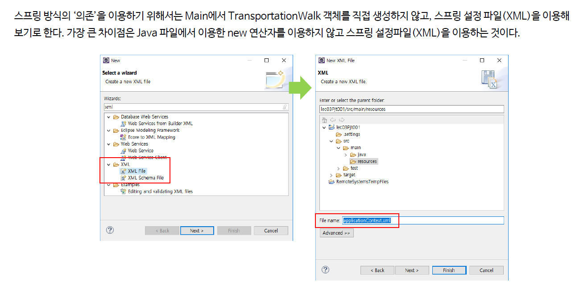
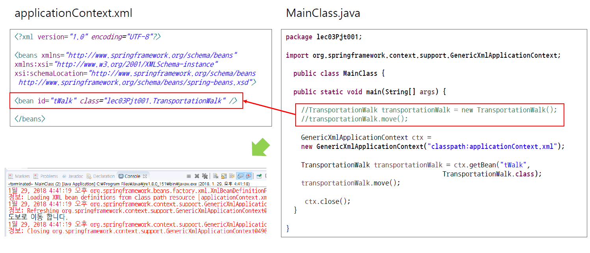

# ch05_SpringProjStart

* Bean을 만들어주는 녀석 = applicationContext.xml
* Bean = Object

### 우선 따라해보는 Spring 프로젝트





*src/main/resources/applicationContext.xml*

```xml
<?xml version="1.0" encoding="UTF-8"?>

<beans xmlns="http://www.springframework.org/schema/beans"
	xmlns:xsi="http://www.w3.org/2001/XMLSchema-instance"
	xsi:schemaLocation="http://www.springframework.org/schema/beans 
 		http://www.springframework.org/schema/beans/spring-beans.xsd">

	<bean id="tWalk" class="ch05_springProjStart.TransportationWalk" />
	
</beans>
```

* applicationContext.xml이 있으면 new를 통해 새로이 객체를 생성하지 않아도 된다.

*MainClass.java*

```java
package ch05_springProjStart;

import org.springframework.context.support.GenericXmlApplicationContext;

public class MainClass {
	public static void main(String[] args) {
		// TransformationWork transformationWork = new TransformationWork();
		// transformationWork.move();

		GenericXmlApplicationContext ctx = new GenericXmlApplicationContext("classpath:applicationContext.xml");
		TransportationWalk transformationWork = ctx.getBean("tWalk", TransportationWalk.class);
		transformationWork.move();
		
		ctx.close();
	}
}

```

