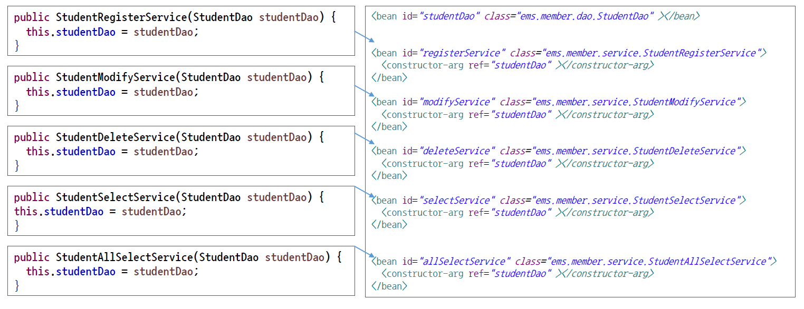

# ch8_다양한의존객체주입

1. 생성자를 이용한 의존성 객체 주입

   

   * applicationContext.xml에서 객체를 생성해서 사용한다.
   * `<constructor-arg ref='studentDao'></constructor-arg>`라는 태그를 이용해서 ref속성의 속성값으로 해당하는 객체의 아이디 값만 넣어주면된다. 그러면 객체가 생성이 될 때, 바로 주입이 되면서 생성이 된다.

2. Setter를 이용한 의존성 객체 주입

   

   * **setter 메서드의 이름에서 set을 빼고, 소문자로 바꾼뒤에 `<property>`태그에 name으로 넣어준다.**
   * `value`에는 Parameter로 들어갈 값을 넣어준다.

3. List를 이용한 의존성 객체 주입

   

   * 들어오는 값이 List 타입인 경우에 사용한다.
   * 위에서 사용한 것처럼, name은 set을 떼고 소문자로 바꿔준다.

4. Map을 이용한 의존성 객체 주입

   

   * key-value 형태로 쌍을 이루어서 값을 준다.

