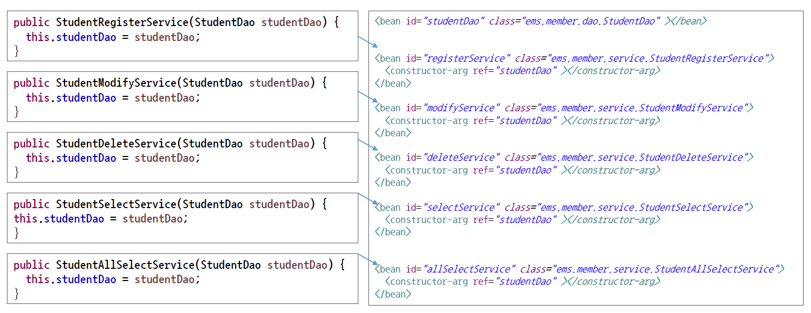

# ch7_Dependency injection	

### Dependency injection이란?


* 우리가 어떠한 프로젝트를 만들 때, 객체 하나하나 마다 모든 프로그램에 다 엮여 있다면 객체 하나만 교체하고 싶은데도 하지 못하는 상황이 발생하게 된다. 객체가 전체 프로젝트에 구속이 되어있는것이 배터리 일체형이랑 같은 상황이다.
* 객체를 따로따로 분리해서 결합할 수 있도록 한다면, 객체 수정이 필요할 때, 프로젝트를 다시 만들지 않아도 된다. 이게 바로 객체지향프로그래밍의 유연성이라고 부르는 것인데, 이는 위의 배터리 분리형에 해당한다.
* Dependency Injection = 배터리에 의존해서 가는 차와 같이, 객체에 의존하도록 구현하는 것.


* 위의 코드에서 배터리를 주입하는것 = Dependency injection
* 위의 3개 중에서 가장 유연한 것은 3번째 코드(사실 2, 3은 별 차이가 없다. 처음 배터리를 넣어주는지 아닌지의 차이)


* 스프링 설정파일에서 `GenericXmlApplicationContext`라는 클래스를 통해서 Bean객체들이 스프링 컨테이너 안에 생성된다. 이러한 객체들은 `getBean()`이라는 메서드로 가져다 사용한다.
* 왼쪽 그림을 보면 객체안에 두개의 객체가 있는 것을 볼 수 있는데, 이는 DI가 이루어지는 형태라고 할 수 있다.



* 위의 코드를 보자. 모든 메서드가 StudentDAO라는 객체를 의존하고 있다. 
* applicationContext.xml에서 보면 `<constructor-arg ref="studentDAO"></constructor=arg>`라는 코드로 각 객체가 생성될때, studentDAO를 참조하도록 만들어주고 있음을 알 수 있다.

---

### 의존성 주입은 왜 하는가?

한마디로 뭔가 필요한게 있으면 내가 가서 찾아오던지, 직접 만드는 대신 무엇이 필요하다고 선언만 하면 외부에서 알아서 해주겠다는 것이다.

그 이유는 다양하지만, 그 중 가장 큰 이유는  "그런건 컨테이너가 알아서 할테니, 빈/서비스/컴포넌트는 알아서 할일에만 신경쓰렴" 이라고 할 수 있다. 즉, '관심의 분리'를 달성하기 위해서이다.

좀 더 쉽게 이해를 해보자. 보통 class의 인스턴스를 다음과 같이 생성해서 사용한다.

```java
MyClass myclass = new MyClass();
```

그런데 인스턴스의 생성 비용이 크거나, 여러군데에서 사용한다거나, 굳이 이걸 일일이 생성해서 사용해야하나? 와 같은 이유가 있을 수 있다.

그럴 때, 인스턴스의 생성을 컨테이너(Spring Framework)에 맡겨서 일괄적으로 진행한 후에, life-cycle 관리 역시 컨테이너에 맡겨버리는 것이다. 필요할때만 인스턴스를 컨테이너로부터 주입받아서 사용하는 것.

인스턴스의 생성 및 관리 주체가 사용자가 아닌 컨테이너가 되기 때문에, '제어의 역전'이 일어나는 것이고, 그 방법중에 하나로 의존성 주입이 있다는 것이다. 