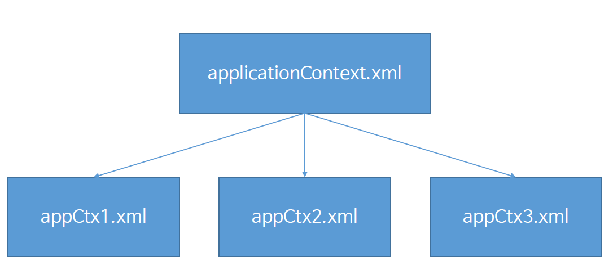
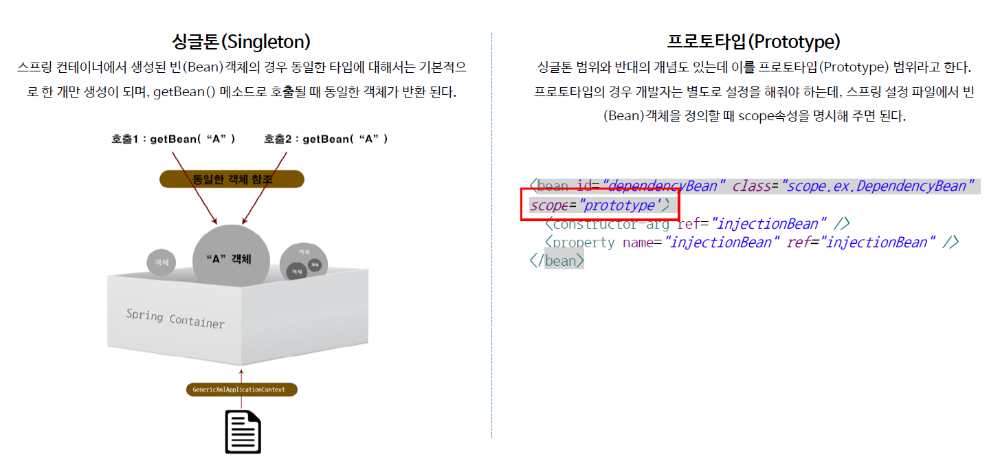

# ch09_Spring설정파일분리

#### 스프링 설정파일 효율적으로 관리하기 위해서 설정파일을 분리하는 법을 알아보자

1. 스프링 설정 파일 분리

   

   스프링 설정파일은 내 마음대로 분리할 수 있다. 그러나 보통은 기능별로 나눈다.

   그 전에 햇던 applicationContext.xml을 3가지로 분리해서 저장 할 수 있다.

   appCtx1에는 dao객체 생성하는 것들만, appCtx2에는 데이터베이스와 관련된 부분만 따로 저장, appCtx3에는  정보서비스 관련된 부분만 따로 저장해서 관리하는 방법이다. 

   이렇게 분리해서 사용하면 편하게 관리할 수 있다.

   기존에 컨텍스트 파일을 사용하려면

   *MainClassUseXML.java*

   ```java
   //		StudentAssembler assembler = new StudentAssembler();
   		GenericXmlApplicationContext ctx = 
   				new GenericXmlApplicationContext("classpath:applicationContext.xml");
   ```

   이렇게 한개만 불러오면 됬지만, 이렇게 분리해서 사용한다면

   *MainClassUseXMLs.java*

   ```java
    //		StudentAssembler assembler = new StudentAssembler();
   		String[] appCtxs = {"classpath:appCtx1.xml", "classpath:appCtx2.xml", "classpath:appCtx3.xml"};
   		GenericXmlApplicationContext ctx = 
   				new GenericXmlApplicationContext(appCtxs);
   ```

   이렇게 배열로 받아오면 된다.

   MainClass를 실행하면 다음과 같이 console에 표시된다.

   ```console
   11월 10, 2018 1:40:07 오후 org.springframework.beans.factory.xml.XmlBeanDefinitionReader loadBeanDefinitions
   정보: Loading XML bean definitions from class path resource [appCtx1.xml]
   11월 10, 2018 1:40:07 오후 org.springframework.beans.factory.xml.XmlBeanDefinitionReader loadBeanDefinitions
   정보: Loading XML bean definitions from class path resource [appCtx2.xml]
   11월 10, 2018 1:40:07 오후 org.springframework.beans.factory.xml.XmlBeanDefinitionReader loadBeanDefinitions
   정보: Loading XML bean definitions from class path resource [appCtx3.xml]
   11월 10, 2018 1:40:07 오후 org.springframework.context.support.GenericXmlApplicationContext prepareRefresh
   정보: Refreshing org.springframework.context.support.GenericXmlApplicationContext@2dda6444: startup date [Sat Nov 10 13:40:07 KST 2018]; root of context hierarchy
   ```

   이를 통해 제대로 appCtx를 가져왔음을 알 수 있다.

   또한 이렇게 3개로 나눴던 appCtx들을 한군데에 import하는 방식도 있다.

   *appCtxImport.xml*

   ```xml
   ...
   <import resource="classpath:appCtx2.xml"/>
   	<import resource="classpath:appCtx3.xml"/>
   ...
   ```

   이렇게 하면 위처럼 배열로 하지않아도 된다.	

2. Bean의 범위

   

   Spring 프레임워크에서는 GenericXmlApplicationContext를 통해서 미리 객체를 생성해두고, Java코드에서는 호출만 해서 사용한다. 그러나 이렇게 생성한 객체가 동일한 객체를 참조한다면, 동일한 타입에 대해서는 기본적으로 한 개만 생성이 되며, getBean() 메소드로 호출될 때 동일한 객체가 반환이 되는 것이 Singleton 디자인 패턴이라고 한다.

   이와 반대되는 것은 프로토타입이라고 한다. 호출할 때마다 다른 객체가 새로 생성됬으면 좋겠다면 해당하는 bean태그를 만들 때, `scope="prototype"`이라는 옵션을 주면 getBean으로 객체를 참조할 때, 새로운 객체를 계속 만들면서 참조를 하게된다.

   singleton은 Default값이라, 그렇게 신경안쓰고 만들어줘도된다. 