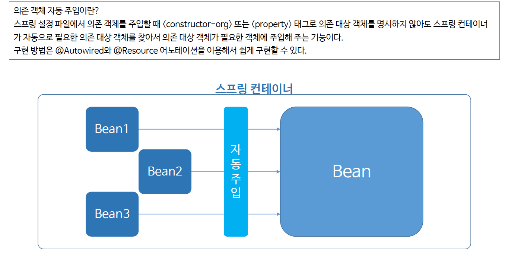
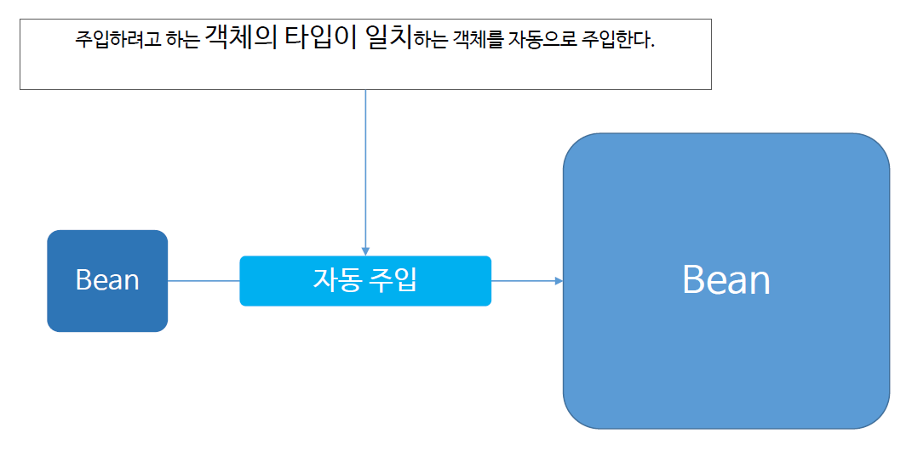
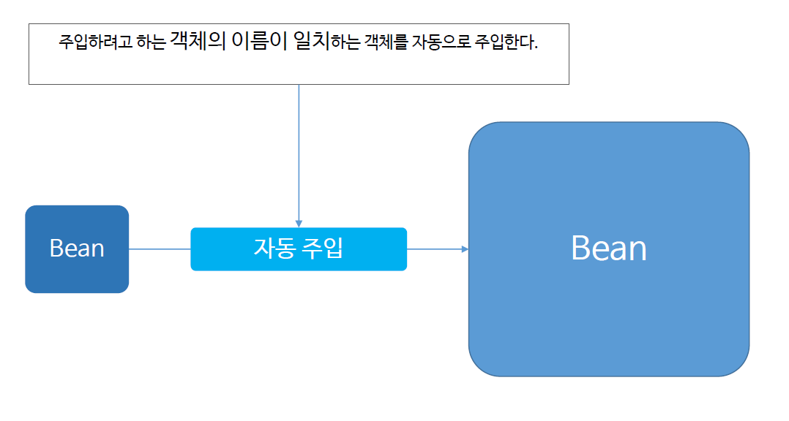

# ch10_의존객체자동주입

### 1. 의존객체 자동 주입?

### 2. Autowired

* 여러개의 빈과, 여러개의 Property, 메소드, 생성자가 있는 스프링 컨테이너 안에서 객체의 이름이 아닌 타입을 보고 자동으로 Property, 메소드, 생성자에 객체를 주입시켜주는 기능이다.

* autowired는 생성자, 메소드, Property 어디든 사용가능하다.
* 생성자에 autowired를 쓸 때는 상관없지만, 메소드나 property에 autowired를 사용할 땐 반드시 default생성자를 명시를 해줘야한다. 그 이유는 객체가 생성이 우선 되어야, Parameter를 메소드나 Property에 가져올 수 있는데, 그런데, default생성자 없이 객체를 Parameter로 받는 생성자만 존재한다면, 객체가 생성되지 않기 때문에 에러가 발생한다. 그렇기에 반드시 default생성자를 명시해줘야만 한다.

### 3. Resource

* `@Autowired`랑 거의 비슷하지만, 객체의 타입을 보지 않고, 객체의 이름을 본다.
* `@Resource`는 생성자에 사용하지 못한다.
* 물론 이때도 기본생성자를 꼭 만들어줘야만 한다.
* 그냥 자동주입을 메소드나 Property에 해줄 때에는 무조건 기본 생성자를 만들어주자. 그래야지 객체가 일단은 생성이 되고나서 자동주입을 하건 뭘 하건 할 수 있기 때문이다.

