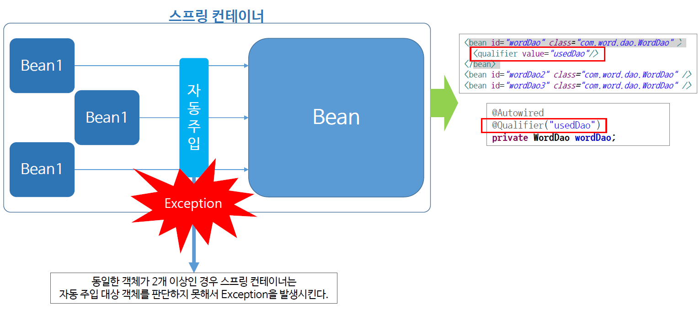
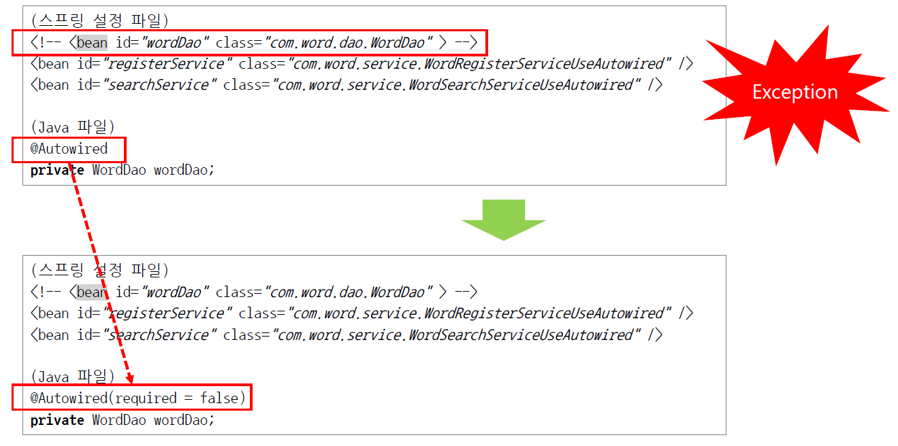
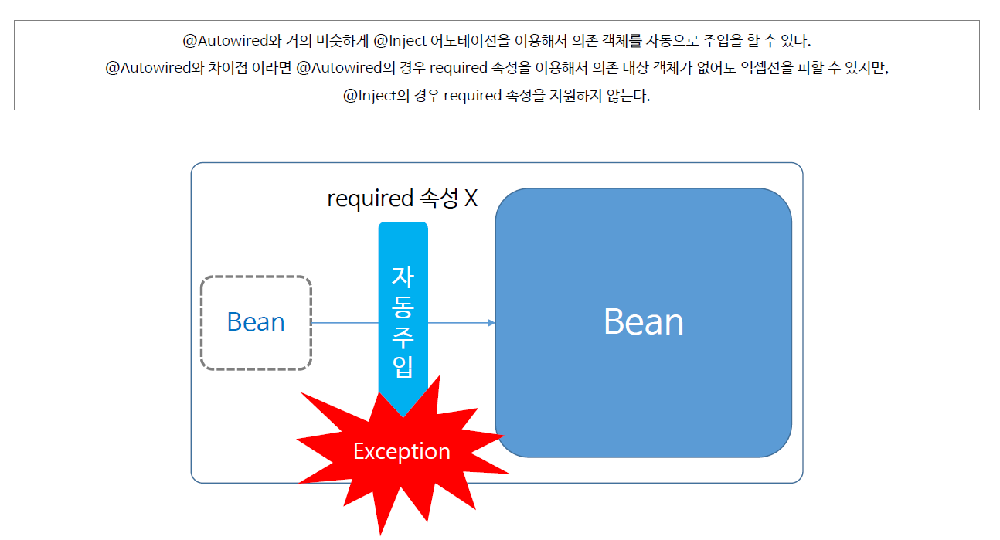

# ch11_의존객체선택

##### 다수의 빈 객체 중 의존 객체의 댓아이 되는 객체를 선택하는 방법에 대해 알아보자

1. 의존 객체 선택에서의 Exception발생상황

   

* 예외가 발생하면, 오른쪽위의 코드와 같이 `<qualifier>`태그를 사용해서 선택해야하는 상황에서 제일 먼저 이 객체를 선택하겠다고 선언해주면 된다.

2. 의존객체 자동 주입 체크

* 위처럼 bean객체가 없는데도 Autowired를 쓰면 당연하게 예외가 발생할 수 밖에 없다. 없는 객체를 부르면 무엇하겠는가.
* 이때, 예외가 발생하게 하지 않는 방법이 있다. `@Autowired`에 `(required = false)`를 붙여주면된다. 저 의미는 의존객체가 있으면 주입을 하고, 아니면 하지말라는 의미. 
* 만들어 놓지도 않고 주입을 하겠다는 개발자는 없으므로, 저런걸 쓸 경우가 없다.

3. Inject

* required를 지원하지 않을 뿐이지만 거의 그럴 일이 없기 때문에, 그냥 autowired랑 똑같다고 생각하면 됨.
* inject에서는 qualifier대신에 `@Named(value="bean객체의 id")`만 써주면 된다. 따로 bean 객체에 할일은 없음! 이부분에서는 Autowired보단 편하다.
