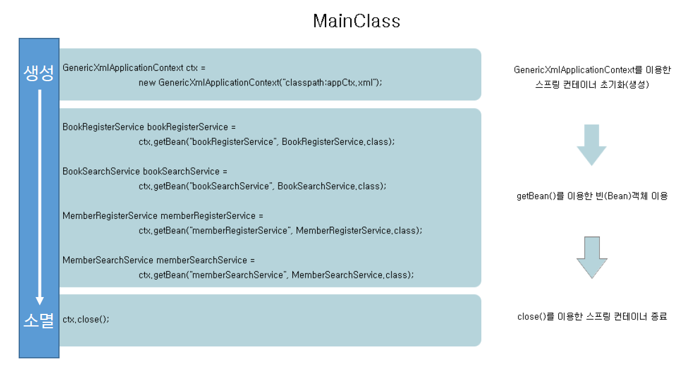
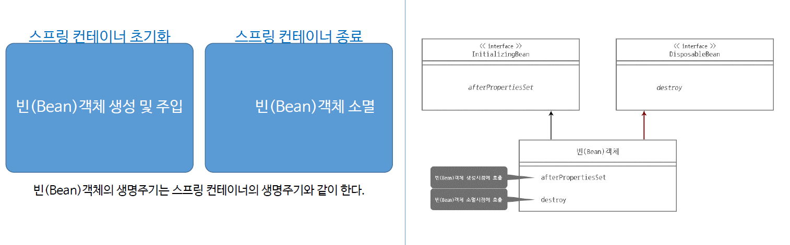
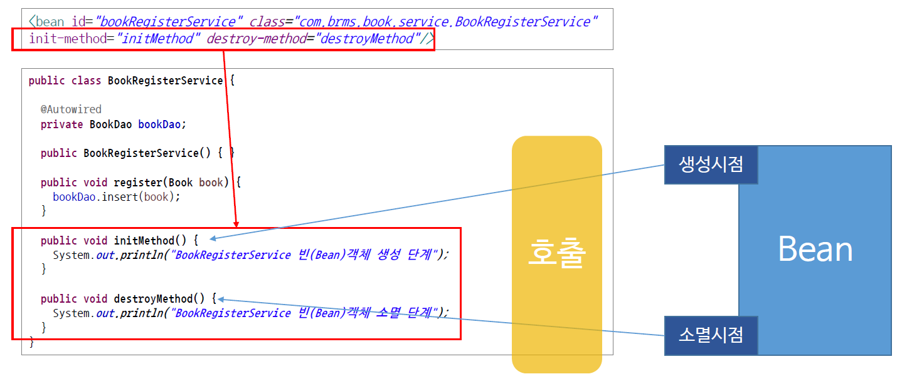

# ch12_Lifecycle

1. 스프링 컨테이너 생명주기

   

* 컨테이너가 생성되는 시점은 `GenericXmlApplicationContext` 객체가 생성될 때 생성이 된다.
* 컨테이너가 생성됨과 동시에, Bean객체의 생성이 이루어진다. 즉 같이 생성된다고 보면 됩니다.
* 필요한 객체들을 getBean() 메소드로 가져다 쓰고, 그 뒤, 스프링 컨테이너를 `ctx.close()`를 통해 자원을 해제한다. 이와 동시에 스프링 컨테이너 안에 있는 Bean객체도 소멸이 된다.

2. 빈 객체 생명주기

   

   * Interface는 뭔가 작업이 명시만 되어있지 딱히 뭔가 기능같은건 없는 추상적인 것.
   * 오른쪽 그림을 보면 두 개의 인터페이스를 통해 Bean객체에서 두개의 메소드를 구현 해준다. 
   * 해당 작업이 생성(afterPropertiesSet), 소멸(destroy)하는 시점에 구현해 둔 메소드가 작동된다. 
   * ex> DB인증작업

3. init-method, destroy-method

   

