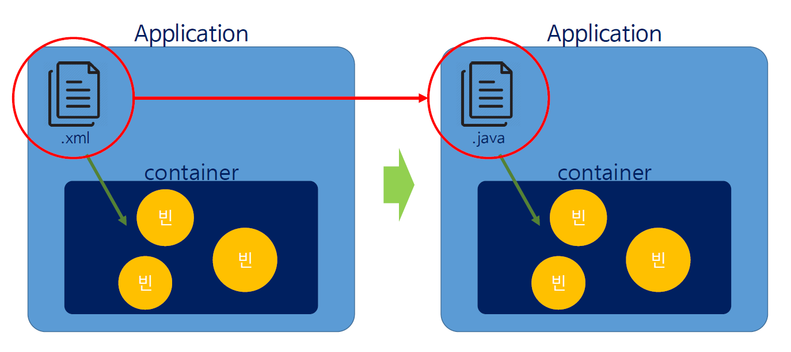
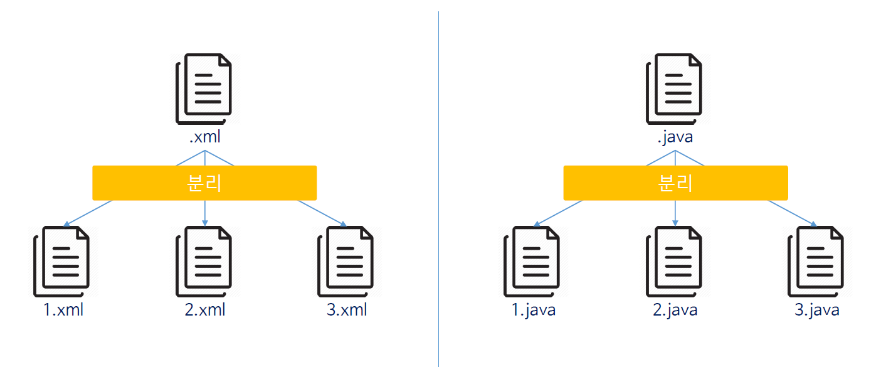
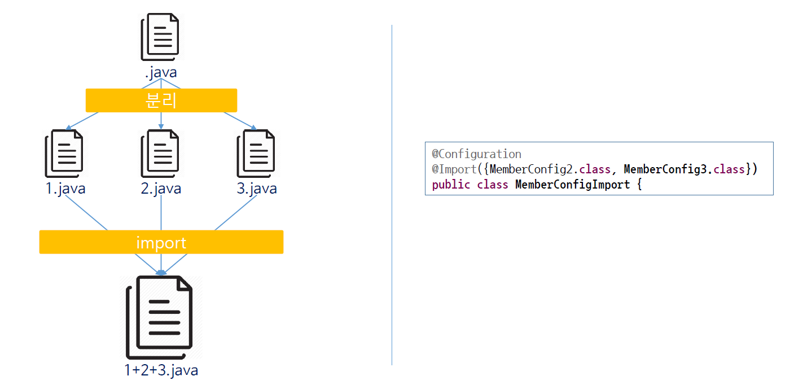

# ch13_annotation을_이용한__스프링설정

기존에 XML을 이용해서 스프링 설정파일을 제작했다면, 이제는 Java파일의  annotation을 이용해서 스프링 컨테이너를 만드는 방법을 배운다.

이 방법 역시 xml로 만들 때랑 같다. 기능별로 나눠서 만들 수도 있고, 하나에 다른 여러개의 xml을 import해서 만드는 것까지 다 가능하다.

다음 그림을 보자



우리는 기존에 스프링 컨테이너를 만들기 위해서 xml을 이용해서 객체를 생성하고, 의존설정도 해줬었다. 그러나 이제는 Java파일의 annotation을 통해서 같은 기능을 수행한다.

@Configuration이라는 annotation을 사용하면 java를 xml파일처럼 사용이 가능하다. 또한, bean 태그를 사용하고 싶다면 위에 @Bean이라는 annotation을 사용하도록 하자. 메소드의 이름은 빈태그의 이름, 반환형은 객체의 타입. 아래의 코드를 보면 이해할 수 있을 것이다.

*memberConfiguration.java*

```java
@Configuration
public class MemberConfig{
    	//	<bean id="studentDao" class="ems.member.dao.StudentDao" ></bean>
	@Bean
	public StudentDao studentDao() {
		return new StudentDao();
	}
    
}
```

추가로, 객체 의존성 주입을 하려면, 반환하는 객체에 참조하고자 하는 객체를 생성자의 파라미터에 넣어준다.

```java
import ems.member.dao.StudentDao;
...	
    //	<bean id="registerService" class="ems.member.service.StudentRegisterService">
//	<constructor-arg ref="studentDao" ></constructor-arg>
//</bean>
	@Bean
	public StudentRegisterService registerService() {
		return new StudentRegisterService(studentDao());
	}
...
```

Java코드에서 DB를 잇는 JDBC와 같은 객체를 사용하고자 할때는 다음과 같이 구현해준다.

```java
	//<bean id="dataBaseConnectionInfoDev" class="ems.member.DataBaseConnectionInfo">
	//	<property name="jdbcUrl" value="jdbc:oracle:thin:@localhost:1521:xe" />
	//	<property name="userId" value="scott" />
	//	<property name="userPw" value="tiger" />
	//</bean>

@Bean
	public DataBaseConnectionInfo dataBaseConnectionInfoDev() {
		DataBaseConnectionInfo infoDev = new DataBaseConnectionInfo();
		infoDev.setJdbcUrl("jdbc:oracle:thin:@localhost:1521:xe");
		infoDev.setUserId("scott"); // id setter
		infoDev.setUserPw("tiger"); // pw setter
		
		return infoDev; // 연결 정보를 담고 있는 객체를 return
	}
```

이제 그 아래에 있는 list 또는 map을 이용한 의존성 객체 주입은 다음과 같이 구현한다.

```java
//	<bean id="informationService" class="ems.member.service.EMSInformationService">
//	<property name="info">
//		<value>Education Management System program was developed in 2015.</value>
//	</property>
//	<property name="copyRight">
//		<value>COPYRIGHT(C) 2015 EMS CO., LTD. ALL RIGHT RESERVED. CONTACT MASTER FOR MORE INFORMATION.</value>
//	</property>
//	<property name="ver">
//		<value>The version is 1.0</value>
//	</property>
//	<property name="sYear">
//		<value>2015</value>
//	</property>
//	<property name="sMonth">
//		<value>1</value>
//	</property>
//	<property name="sDay">
//		<value>1</value>
//	</property>
//	<property name="eYear" value="2015" />
//	<property name="eMonth" value="2" />
//	<property name="eDay" value="28" />
//	<property name="developers">
//		<list>
//			<value>Cheney.</value>
//			<value>Eloy.</value>
//			<value>Jasper.</value>
//			<value>Dillon.</value>
//			<value>Kian.</value>
//		</list>
//	</property>
//	<property name="administrators">
//		<map>
//			<entry>
//				<key>
//					<value>Cheney</value>
//				</key>
//				<value>cheney@springPjt.org</value>
//			</entry>
//			<entry>
//				<key>
//					<value>Jasper</value>
//				</key>
//				<value>jasper@springPjt.org</value>
//			</entry>
//		</map>
//	</property>
//	<property name="dbInfos">
//		<map>
//			<entry>
//				<key>
//					<value>dev</value>
//				</key>
//				<ref bean="dataBaseConnectionInfoDev"/>
//			</entry>
//			<entry>
//				<key>
//					<value>real</value>
//				</key>
//				<ref bean="dataBaseConnectionInfoReal"/>
//			</entry>
//		</map>
//	</property>
//</bean>
	
	@Bean
	public EMSInformationService informationService() {
		EMSInformationService info = new EMSInformationService();
		info.setInfo("Education Management System program was developed in 2015.");
		info.setCopyRight("COPYRIGHT(C) 2015 EMS CO., LTD. ALL RIGHT RESERVED. CONTACT MASTER FOR MORE INFORMATION.");
		info.setVer("The version is 1.0");
		info.setsYear(2015);
		info.setsMonth(1);
		info.setsDay(1);
		info.seteYear(2015);
		info.seteMonth(2);
		info.seteDay(28);
		
		ArrayList<String> developers = new ArrayList<String>();
		developers.add("Cheney.");
		developers.add("Eloy.");
		developers.add("Jasper.");
		developers.add("Dillon.");
		developers.add("Kian.");
		info.setDevelopers(developers);
		
		Map<String, String> administrators = new HashMap<String, String>();
		administrators.put("Cheney", "cheney@springPjt.org");
		administrators.put("Jasper", "jasper@springPjt.org");
		info.setAdministrators(administrators);
		
		Map<String, DataBaseConnectionInfo> dbInfos = new HashMap<String, DataBaseConnectionInfo>();
		dbInfos.put("dev", dataBaseConnectionInfoDev());
		dbInfos.put("real", dataBaseConnectionInfoReal());
		info.setDbInfos(dbInfos);
		
		return info;
	}
```

이제 이렇게 만든 java파일을 가져다 사용할 일만 남았다. 이는 MainClass에서 다음과 같이 사용한다.

```java
...
    //		StudentAssembler assembler = new StudentAssembler();
    //		GenericXmlApplicationContext ctx = 
//				new GenericXmlApplicationContext("classpath:applicationContext.xml");
		AnnotationConfigApplicationContext ctx = 
				new AnnotationConfigApplicationContext(MemberConfig.class);
```

---

이제 이것을 분리시켜보자 분리하는 방법은 xml과 다를 거 없이 다음과 비슷하다. 구조는 다음과 같다.



왜 분리할까? 코드가 길어지면 유지보수가 힘들게 되기 때문이다. 일반적으로 구분할때의 기준은 다음과 같다. 

* DB와 연결되는 DAO
* Service객체들을 모아놓은 Service
* DB와 관련되어있는 정보
* Util들

실제로 기존의 코드를 나눠보자. 

우리는 DAO&Service, DB와 관련된 정보, Util들 3개로 나누기로 한다.

나누다 보면 config2번에 생성된 DB 정보관련 객체를 config3번의 파일에서 사용해야하는데, 이는 다음과 같이 이어준다.

*memberConfig3.java*

```java
...	
	@Autowired
	DataBaseConnectionInfo dataBaseConnectionInfoDev;
	
	@Autowired
	DataBaseConnectionInfo dataBaseConnectionInfoReal;
...	
    	Map<String, DataBaseConnectionInfo> dbInfos = new HashMap<String, DataBaseConnectionInfo>();
		dbInfos.put("dev", dataBaseConnectionInfoDev);
		dbInfos.put("real", dataBaseConnectionInfoReal);
		info.setDbInfos(dbInfos);
...
```

이렇게 `@Autowired`를 통해서 MemberConfig2번과 이어주면 된다. 이렇게 코드를 짜준다면, MemberConfig2번에 생성된 객체가 3번으로 자동주입이 된다. 이렇게 자동 주입된 객체는 아래의 코드에서 사용된다.

3개를 만든뒤에 사용하는 방법은 xml파일과 다르게 그저 나열해주면 된다.

*MainClassUseConfigurations.java*

```java
...
AnnotationConfigApplicationContext ctx = 
				new AnnotationConfigApplicationContext(MemberConfig1.class, MemberConfig2.class, MemberConfig3.class);
...
```

---

다음으로 나눈 config파일을 한군데에 import 해서 사용해보자



*MemberConfigImport.java*

```java
...
@Configuration
@Import({MemberConfig2.class, MemberConfig3.class})
public class MemberConfigImport {
...
```

*MemberConfigurationsImport.java*

```java
//		StudentAssembler assembler = new StudentAssembler();
//		GenericXmlApplicationContext ctx = 
//				new GenericXmlApplicationContext("classpath:appCtxImport.xml");
		AnnotationConfigApplicationContext ctx = 
				new AnnotationConfigApplicationContext(MemberConfigImport.class);
```

위의 코드처럼 구현한다면 import 해서 같은 결과를 낼 수 있다.