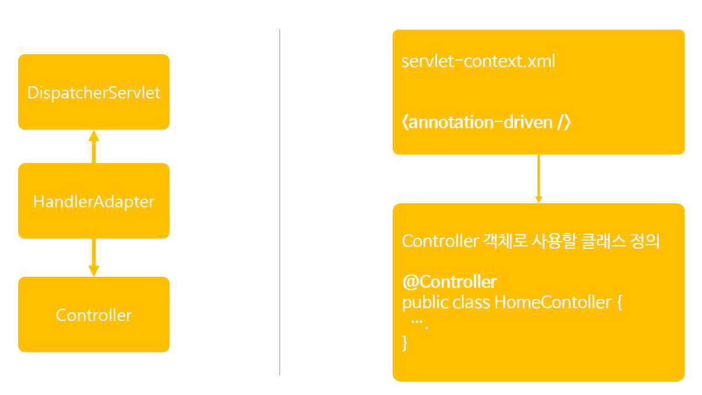

# ch14_웹프로그래밍설계모델

1. 웹프로그래밍을 구축하기 위한 설계 모델

   흔히 웹프로그래밍을 구축하기 위한 설계 모델에는 2가지가 있다. model1, 2인데, 오늘은 그것에 대해 알아보자.

   * 클라이언트 : 이용자
   * WAS : 웹 어플리케이션 서버
   * 데이터베이스

   

   * Was에서 JSP(View), Service, DAO를 분리시키지않고, 모든 것을 하나의 File로 처리해버리는 것을 우리는 Model1이라고 한다.
   * 장점은 개발속도가 빠르다.
   * 그러나 여러가지 언어를 하나의 문서에 써서, 유지보수가 힘들다. 
   * 그리고 스트레스도 가중됩니다...To 개발자

   

   * Controller : 어떠한 요청이 들어왔을 때, 요청을 어떤 서비스에게 작업을 시킬지 Control하는 모듈
   * Service : 다양한 기능을 담당하는 모듈
   * DAO : DB에 접근하도록 하는 모듈
   * Model : DAO에서 Model을 통해 통신
   * View : 보통 JSP로 만들며, 이는 클라이언트에게 보여주기 위함
   * 이렇게 각각의 기능을 모두 모듈화 시키는것. = Model2
   * Model2는 MVC를 기본으로 한다.
   * 장점은 유지보수가 수월하다. 
   * 기본적으로 Spring에서는 MVC가 기본이다.
2. **스프링 MVC 프레임워크 설계 구조** - 굉장히 중요하다.
    

  * 순서를 머릿속에 박아넣자

    1. DispatcherServlet 이 요청을 받아서 HandlerMapping에 던져준다.

    2. HandlerMapping은 여러개 Controller 중 가장 적합한 Controller를 선택한다.(단일이면 하나로 가겠지?)
    3. Controller를 선택하면 응답이 다시 DispatcherServlet으로 돌아온다. 그리고 다시 HandlerAdapter로 요청을 보낸다.
    4. HandlerAdapter에서는 선택한 Controller에서 사용자 요청에 대해 처리할 수 있는 가장 적합한 메소드를 찾는다. 
    5. 찾은 뒤에 Controller에서 Model이라는 처리한 데이터 결과와 view라는 정보를  가져온다.
    6. Model을 가져오면  DispatcherServlet은 ViewResolver에게  Controller에서 가져온 View 정보에 가장 적합한 JSP문서를 찾아달라고 요청을 보낸다.
    7. ViewResolver에서 선택한 가장 적합한 JSP페이지에 DispatcherServlet은 응답을 생성, 그것을 JSP형태로 클라이언트에게 보내 응답처리를 한다.

3. DispatcherServlet 설정 - 따로 직접 코딩할 필요 없다.

   

   * 위의 코드처럼 Web.xml에 등록하면 된다.

   * 아래 보면 `<url-pattern>/</url-pattern>`이라고 나와 있는데, 이는 모든 요청은 DispatcherServlet이 관문역할을 하겠다는 의미

   * `<init-param>`에서는 Spring설정파일에 대해 등록한다.

   * 즉, DispatcherServlet이 Servlet으로 등록될 때, Spring설정파일까지 같이 설정해서 Spring컨테이너를 만든다. 이때 HandlerMapping, HandlerAdapter, ViewResolver 이 3개는 Spring컨테이너의 생성과 동시에 같이 생성된다.

   * 고로 사용자가 직접 만들어야할 것은 Controller과 View뿐이다.

   * 만약에  DispatcherServlet은 만들었는데  Spring컨테이너를 만드는 코드를 설정하지 않으면, 이때는 자동으로 Spring프레임워크가 만든다.

     그 상황은 다음 그림과 같다.

   

4. Controller 객체 

   1. @Controller

   

   * 컨트롤러는 사용자가 만들어야하는데 만드는 방법은 오른쪽의 그림과 같다.
   * `<annotation-drivien/>` 코드를 넣고, Controller객체로 사용할 클래스 위에 `@Controller`라는 annotation을 넣는다.

   2. @RequestMapping

   

   * HandlerAdapter가 컨트롤로에 있는 메서드 중에서 요청에 적절한 메서드를 찾을때 필요한 기능으로, 메서드 위에 `@RequestMapping("/~~")`라고 Annotation 붙여준다. 그럼 해당 메서드를 사용~

   3. Model타입의 파라미터

   

   * 컨트롤러에서 작업한 결과를 Model과 View 받아야 하는데, 선택한 메서드의 파라미터를 Model타입으로 받으면 된다.

5.  View 객체

   

   * 어떻게 View를 찾는가?
   * ViewResolver은 우선 스프링 설정파일에서 빈 객체로 생성한다.
   * 해당하는 메서드에서 Return값을 방금 만든 ViewResolver의 객체에서 prefix, suffix값 사이에 더해줘서 실제 사용자에게 응답해줄 View를 만든다!

6. **전체적인 웹 프로그램이 구조**

   

   1. 클라이언트가 요청, DispatcherServlet이 받음
   2. 요청을 받은 DispatcherServlet이 Web.xml을 통해서 서블릿 등록을 하고, 동시에 초기 Parameter로 스프링 설정파일로 설정한다.
   3. Controller을 통해 적합한 컨트롤러를 찾음, 다시 DispatcherServlet로
   4. RequestMapping을 통해서 사용자 요청에 해당하는 메서드를 찾고 실행(서비스-DAO-DB), Model과 View를 갖고 다시 DispatcherServlet로
   5. View정보를 이용해서 ViewResolver를 통해서 가장 적합한 View를 찾는다. 
   6. 해당 View에  Modle 데이터를 실어서, 사용자에게 JSP로 응답해준다.

 