ch15_SpringMVC웹서비스

1. 이클립스에 STS를 설치하면 Spring 설정이 다 되어있는 Spring 프로젝트가 만들어진다. 이를 마켓플레이스에서 설치하도록 하자.
2. STS를 이용한 웹 프로젝트 생성

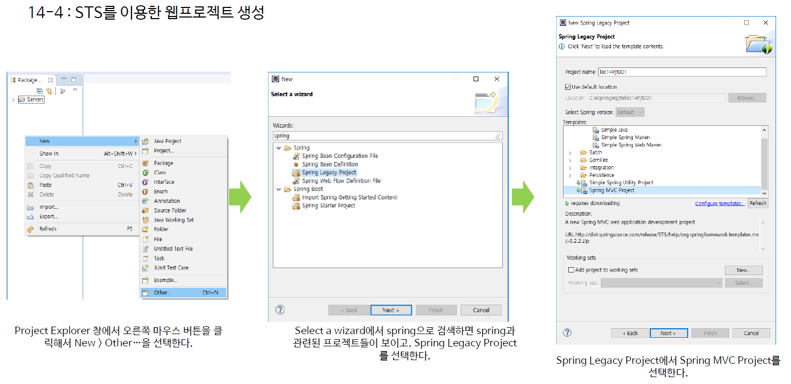

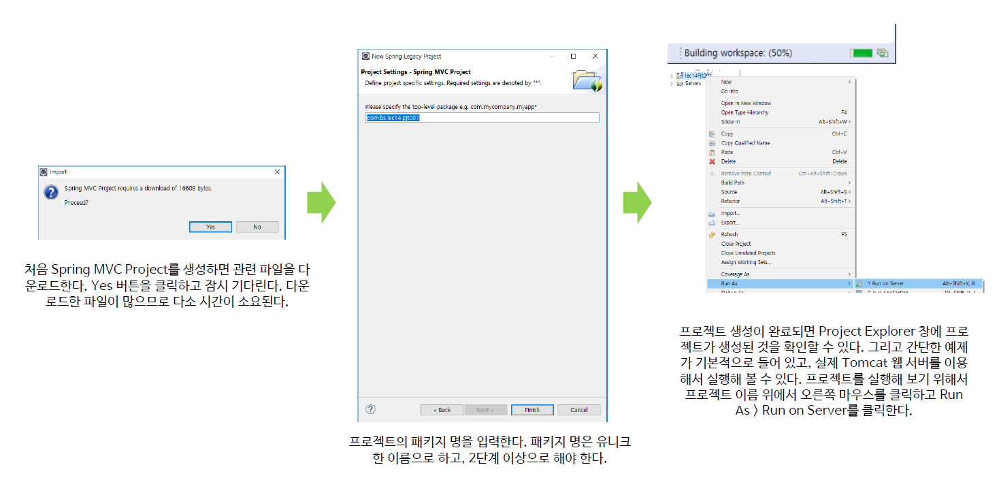

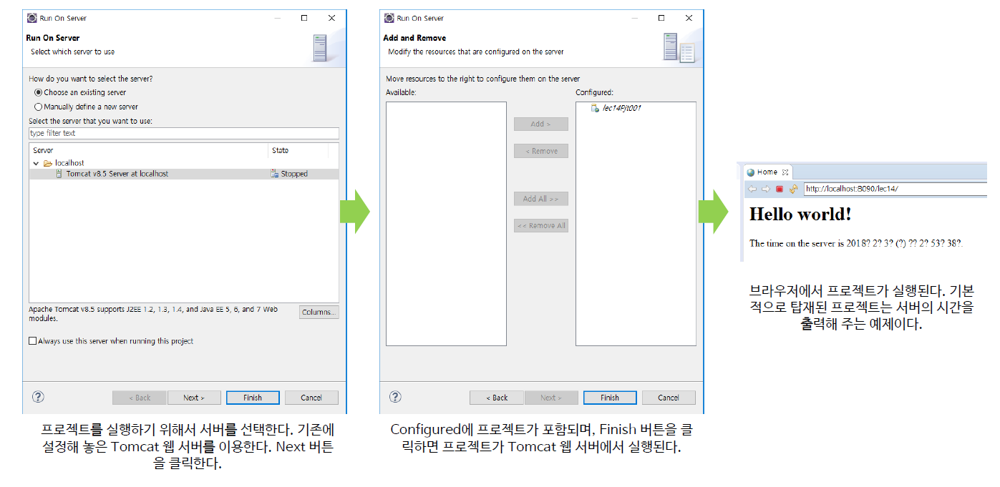

이렇게 프로젝트까지 만들었다면 잘실행되는지 Run on Server로 실행해보자

---

### Spring Legacy Proj 전체 구조

1. 프로젝트 전체 구조

   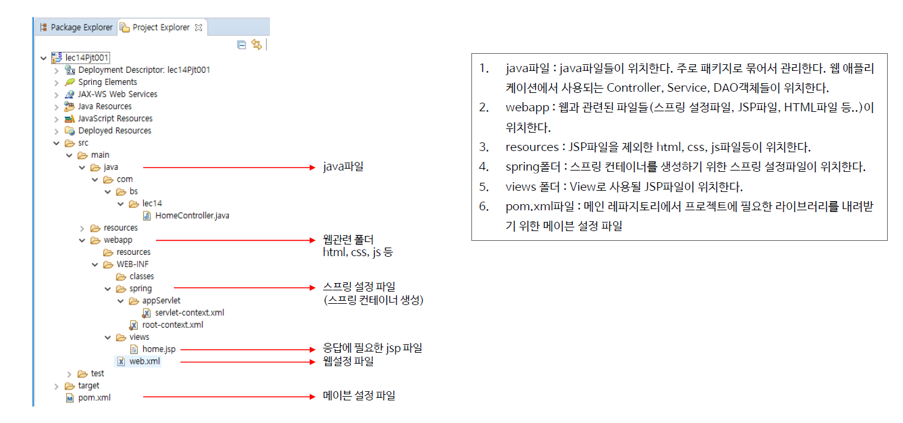

   * servlet-context.xml = 스프링 컨테이너생성 파일

2. Web.xml
   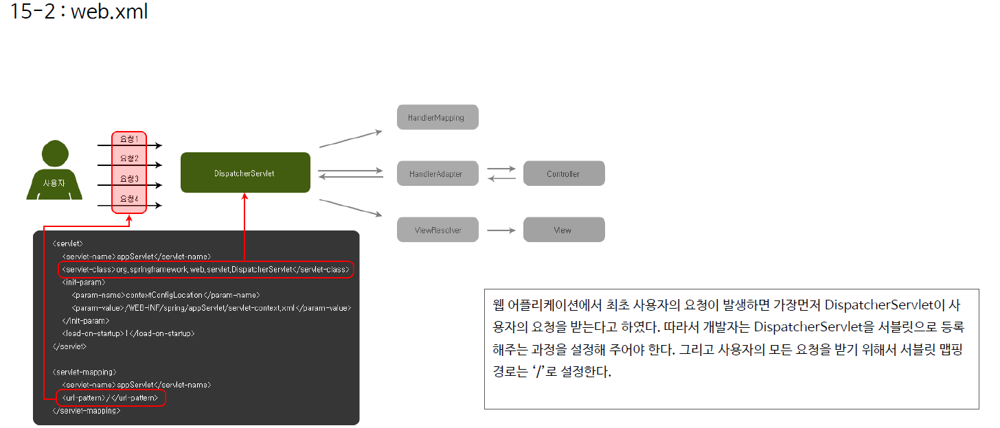

3. DispatcherServlet
   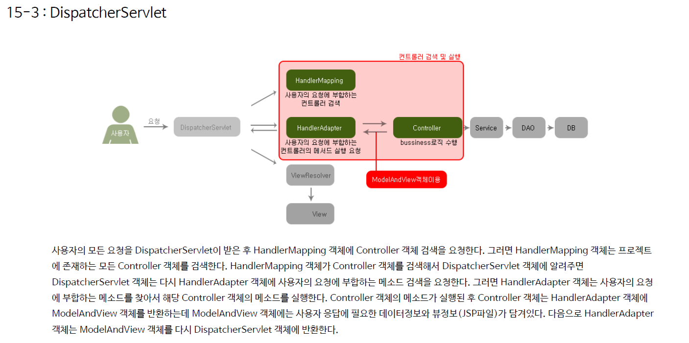

4. ServletContext.xml
   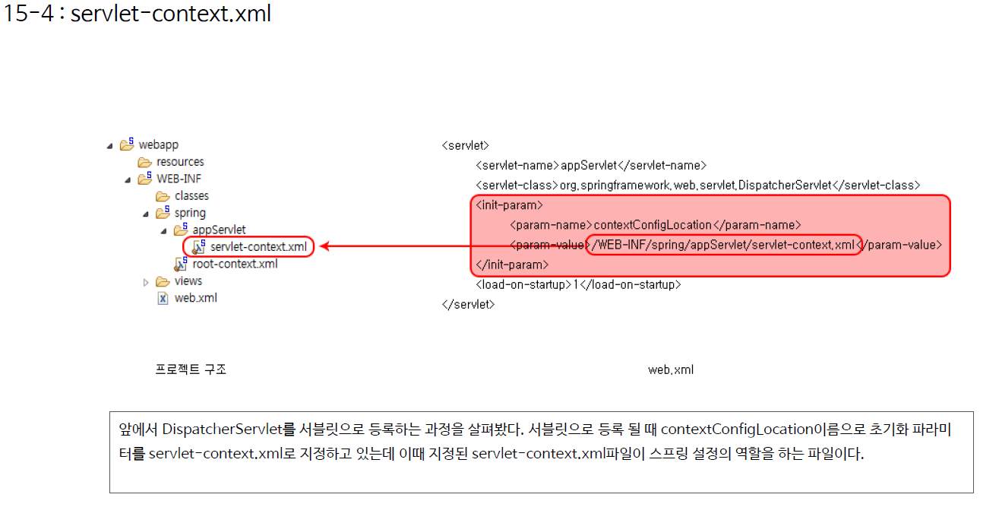
   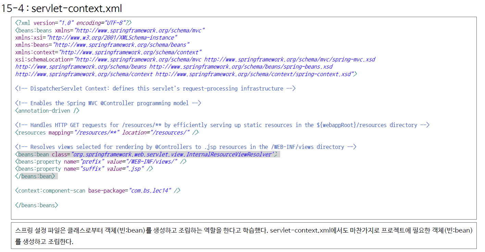
   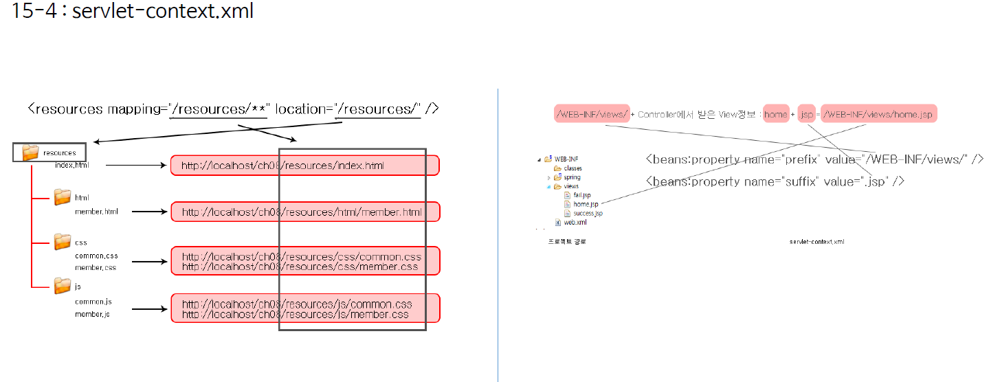

5. Controller
   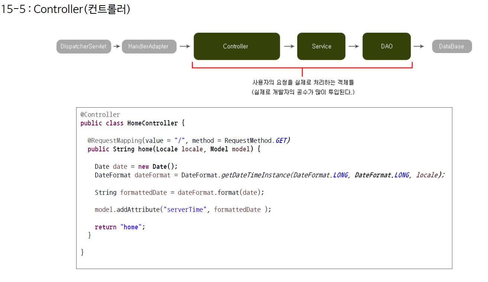
   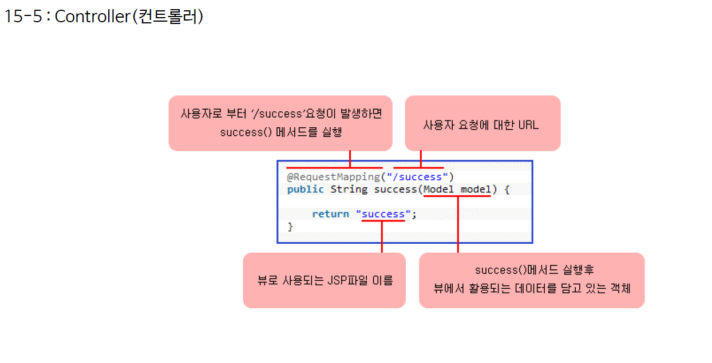

---

### 추가 _  직접 Login.jsp와 Login.java를 만들어주자.

*login.java*

```java
package com.test.pjt15;

import org.springframework.stereotype.Controller;
import org.springframework.ui.Model;
import org.springframework.web.bind.annotation.RequestMapping;

@Controller
public class login {
	
	@RequestMapping("/login") // GET방식은 default이기때문에 생략가능, Value도 생략가능
	public String login(Model model) {
		
		model.addAttribute("loginKey", "loginValue");
	
		return "login"; // login.jsp
	}
	
}
```

*login.jsp*

```jsp
<%@ page language="java" contentType="text/html; charset=EUC-KR"
	pageEncoding="EUC-KR"%>
<!DOCTYPE html PUBLIC "-//W3C//DTD HTML 4.01 Transitional//EN" "http://www.w3.org/TR/html4/loose.dtd">
<html>
<head>
<meta http-equiv="Content-Type" content="text/html; charset=EUC-KR">
<title>login</title>
</head>
<body>
	<h1>Hello Login!</h1>
	<p>loginKey = ${loginKey}</p>
</body>
</html>
```

서버를 구동하고, /login에 접속하면 잘 된다.

