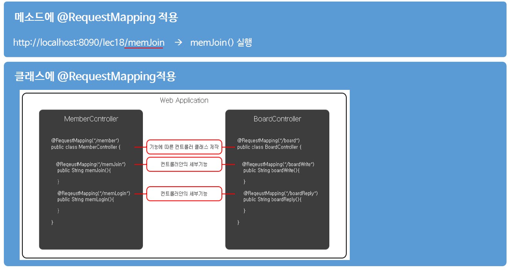

# ch18_Controller객체구현

1. 웹 애플리케이션 준비

   

2. @RequestMapping을 이용한 맵핑

   

   

3. 요청 파라미터

   

   

   

   * 최근에는 Command객체를 통해서 사용하는 방법이 가장 많이 쓰인다.

   ---

   Controller객체구현 - 2

   1. @ModelAttribute

      

      * 어떠한 메서드, 어떠한 url과 맵핑해서 어떤 메서드를 호출하건지간에, `@ModelAttribute`가 적용이 되면 공통적으로 실행이 가능해진다.

      *MemberController.java*

      ```java
      ...
          @ModelAttribute("serverTime")
      	public String getServerTime(Locale locale) {
      		
      		Date date = new Date();
      		DateFormat dateFormat = DateFormat.getDateTimeInstance(DateFormat.LONG, DateFormat.LONG, locale);
      		
      		return dateFormat.format(date);
      	}
      ...
          	@RequestMapping(value = "/memRemove", method = RequestMethod.POST)
      	public String memRemove(@ModelAttribute("mem") Member member) {
      		
      		service.memberRemove(member);
      		
      		return "memRemoveOk";
      	}
      ...
      ```

      *memRemoveOk.jsp*

      ```jsp
      <%@ taglib uri="http://java.sun.com/jsp/jstl/core" prefix="c" %>
      <%@ page session="false" %>
      <html>
      <head>
      	<title>Home</title>
      </head>
      <body>
      	<h1> memRemoveOk </h1>
      	
      	ID : ${mem.memId}<br />
      	
      	<P>  The time on the server is ${serverTime}. </P>
      	
      	<a href="/lec19/resources/html/index.html"> Go Main </a>
      </body>
      </html>
      ```

      * 위의 컨트롤러에서 선언한 remove메소드 이외에도, 호출한 적이 없는 이미 위에서 `@ModelAttribute`를 선언한 `Servertime`메소드는 항상 공통적으로 호출이 되기 때문에 당연히 사용가능

   2. 커맨드 객체 프로퍼티 데이터 타입
        
          

   3. Model & ModelAndView

        

        

        * 실제코드에서보자

        *ModelController.java*

        ```java
        ...
            /*
        	@RequestMapping(value = "/memModify", method = RequestMethod.POST)
        	public String memModify(Model model, Member member) {
        		
        		Member[] members = service.memberModify(member);
        		
        		model.addAttribute("memBef", members[0]);
        		model.addAttribute("memAft", members[1]);
        		
        		return "memModifyOk";
        	}
        	*/
        	
        	@RequestMapping(value = "/memModify", method = RequestMethod.POST)
        	public ModelAndView memModify(Member member) {
        		
        		Member[] members = service.memberModify(member);
        		
        		ModelAndView mav = new ModelAndView();
        		mav.addObject("memBef", members[0]);
        		mav.addObject("memAft", members[1]);
        		
        		mav.setViewName("memModifyOk");
        		
        		return mav;
        	}
        ...
        ```

        * 위가 `Model`사용, 아래가 `ModelAndView`사용

        


