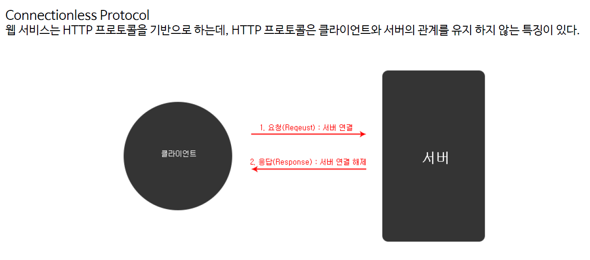
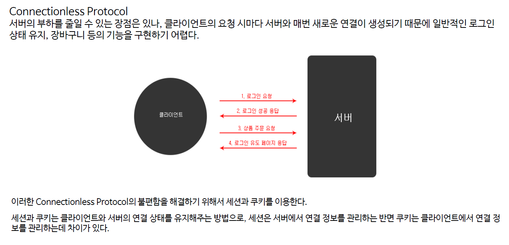
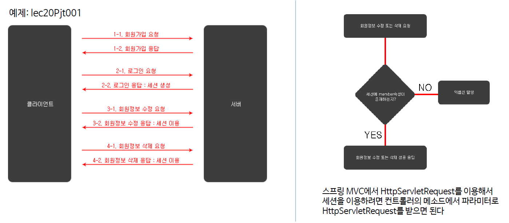
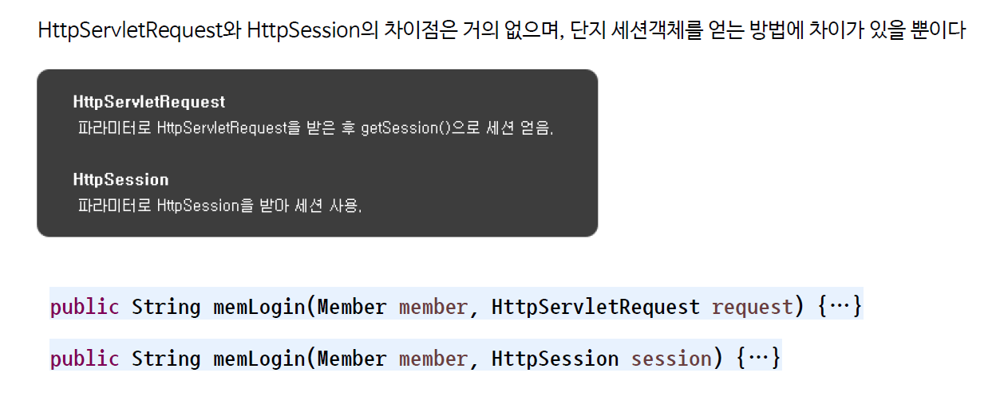
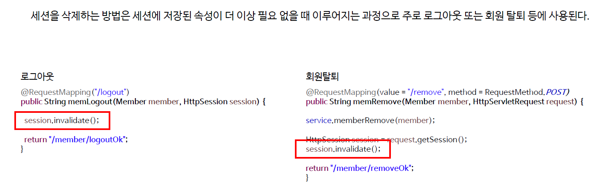
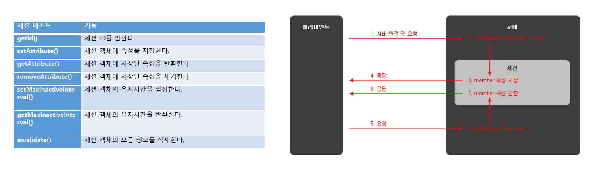
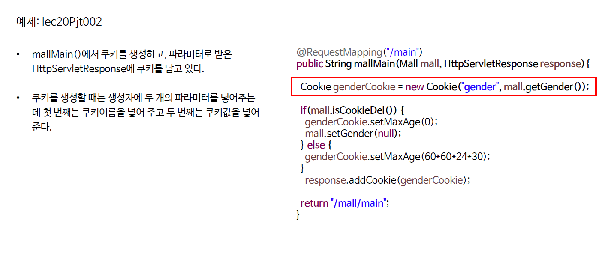
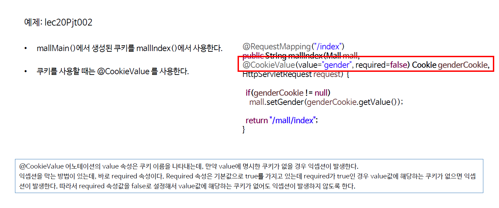

# ch19_Session_Cookie

1. Connectionless Protocol

   

   HTTP에서 한번 응답하고, 바로 끊어버림.

   그 이유는 서버에 연결되어 있는 클라이언트가 하나가 아니기 때문에 , 모든 요청에 대해 연결을 유지한다면, 서버에 과부하가 올 것이다. 그렇기에 이런 방식을 통해서 자원을 효율적으로 사용

   그러나 다음과 같은 단점이 있다. 로그인유지상태에서 무언가를 해야하는 작업에서 매번 연결과 끊음이 일어난다면, 너무 불편하기 때문에, 그래서 우리는 쿠키와 세션을 필요로 한다.

   

2. HttpServletRequest를 이용한 세션 사용
   

   * 세션을 서버에 생성

   *MemberController.java* - JSP에서 사용가능!

   ```java
   ...	
   	@RequestMapping(value = "/login", method = RequestMethod.POST)
   	public String memLogin(Member member, HttpServletRequest request) {
   		
   		Member mem = service.memberSearch(member);
   		
   		HttpSession session = request.getSession();
   		session.setAttribute("member", mem);
   		
   		return "/member/loginOk";
   	}
   ...
   ```

   * `session.setAttribute`에서 `(key, value)`형태로 값을 받아온다.

3. HttpSession을 이용한 세션 사용 - Spring에서만 사용가능!

   

   *memberController.java*

   ```java
   ...
       @RequestMapping(value = "/login", method = RequestMethod.POST)
   	public String memLogin(Member member, HttpSession session) {
   		
   		Member mem = service.memberSearch(member);
   		
   		session.setAttribute("member", mem);
   		
   		return "/member/loginOk";
   	}
   ...
   ```

4. SessionRemovr

   

   * `session.invalidate()`라는 메소드만 넣어주면 된다.

   *MemberController.java*

   ```java
   ...
       	// HttpRequestServlet 사용
       	@RequestMapping("/logout")
   	public String memLogout(Member member, HttpServletRequest request) {
   		
   		HttpSession session = request.getSession();
   		session.invalidate();
   		
   		return "/member/logoutOk";
   	}
   
   		// HttpSession 사용
   		@RequestMapping("/logout")
   	public String memLogout(Member member, HttpSession session) {
   		
   		session.invalidate();
   		
   		return "/member/logoutOk";
   	}
   
   ...
   ```

5. Session 주요 Method 및 플로어

   

   * 상단의 3개의 메소드가 가장 자주 쓰인다.

6. Cookie

   

   

   * required = false 로 줘서 cookie가 없어도 exception이 발생하지 않도록 한다.