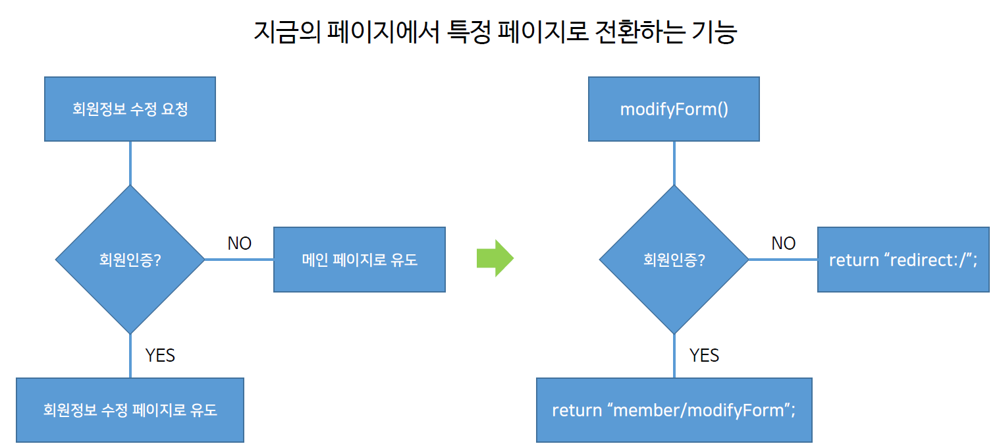
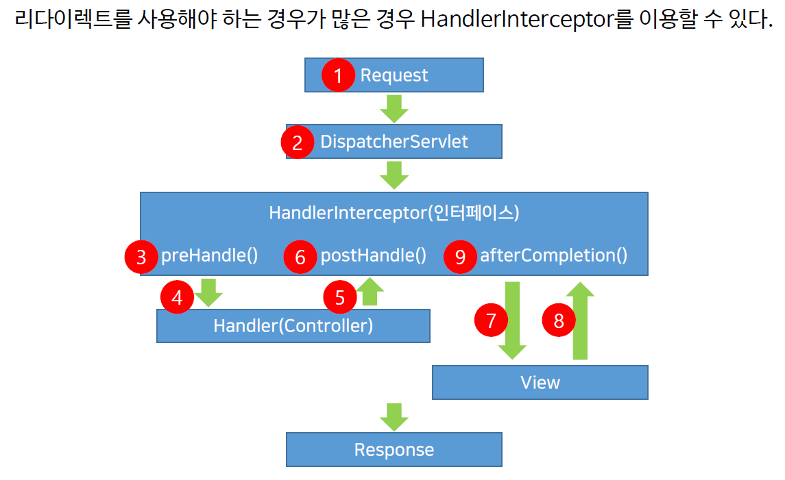

# ch20_redirect_Interceptor

### redirect



* 리다이렉트를 사용할 때는 `return "redirect:/";`(메인화면으로) 이렇게 리다이렉트해서 어디로 갈것인지 표기해줘야한다.

*memberController.java*

```java
	// Modify
	@RequestMapping(value = "/modifyForm")
	public String modifyForm(Model model, HttpServletRequest request) {
		
		HttpSession session = request.getSession();
		Member member = (Member) session.getAttribute("member");
		
		
		if(null == member) {
			return "redirect:/"; // redirect
		} else {
			model.addAttribute("member", service.memberSearch(member));
		}
		
		return "/member/modifyForm";
	}
...
	// ModelAndView를 사용했을때
    // Remove
	@RequestMapping("/removeForm")
	public ModelAndView removeForm(HttpServletRequest request) {
		
		ModelAndView mav = new ModelAndView();
		
		HttpSession session =  request.getSession();
		Member member = (Member) session.getAttribute("member");
		
		if(null == member) {
			mav.setViewName("redirect:/");
		} else {
			mav.addObject("member", member);
			mav.setViewName("/member/removeForm");
		}
		
		
		return mav;
	}
```


### Interceptor

- 인터셉트는 리다이렉트를 좀 더 구조화하고 추상화해서 내 입맛에 맞게 구체화하는데 도움을 주는 인터페이스라고 할 수 있다.



* preHandle() : 컨드롤러가 작업하기 전에 무언갈 하고 싶다면 여기에
* PostHandle() : 컨트롤러가 작업하고나서 무언갈 하고싶다면 여기에
* afterCompletion() : 컨트롤러와 view가 다 작업한 후에 무언갈 하고 싶다면 여기에
* 가장 많이 사용되는것은 preHandle()
* preHandle은 redirect를 대체할 수 있다.

*MemberInterceptorLogin.java*

```java
...
    public class MemberLoginInterceptor extends HandlerInterceptorAdapter {

    @Override
	public boolean preHandle(HttpServletRequest request,
			HttpServletResponse response, Object handler) throws Exception {
		
		HttpSession session = request.getSession(false);
		if(session != null) {
			Object obj = session.getAttribute("member");
			if(obj != null) 
				return true;
		}
		
		response.sendRedirect(request.getContextPath() + "/");
		return false;
	}
        
    @Override
	public void postHandle(HttpServletRequest request,
			HttpServletResponse response, Object handler,
			ModelAndView modelAndView) throws Exception {
		
		super.postHandle(request, response, handler, modelAndView);
	}
...
```

*servlet-context.xml*

```xml
...
	<interceptors>
		<interceptor>
			<mapping path="/member/modifyForm"/>
			<mapping path="/member/removeForm"/>
			<!-- 
			<mapping path="/member/**"/>
			<exclude-mapping path="/member/joinForm"/>
			<exclude-mapping path="/member/join"/>
			<exclude-mapping path="/member/loginForm"/>
			<exclude-mapping path="/member/login"/>
			<exclude-mapping path="/member/logout"/>
			<exclude-mapping path="/member/modify"/>
			<exclude-mapping path="/member/remove"/>
			-->
			<beans:bean class="com.bs.lec21.member.MemberLoginInterceptor"/>
		</interceptor>
	</interceptors>
...
```

* Interceptor가 작동하기를 원하는 곳을 위에서 지정해준다.

