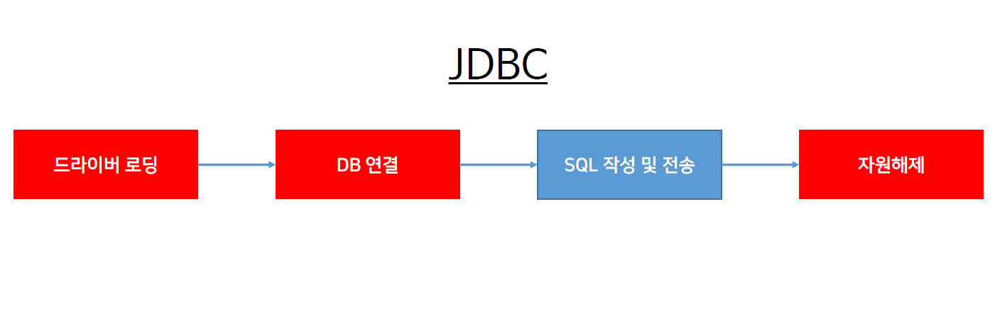

# ch21_JDBC



프로젝트는 기존에 사용하던 프로젝트를 JDBC를 통해 연결하도록하였다.

1. 드라이버 로딩 세팅

   *MemberDAO.java*

   ```java
   ...    
   	private String driver = "oracle.jdbc.driver.OracleDriver";
   	private String url = "jdbc:oracle:thin:@localhost:1521:xe";
   	private String userid = "scott";
   	private String userPw = "tiger";
   
   	private Connection conn = null;
   	private PreparedStatement pstmt = null;
   	private Result rs = null;
   ...
   ```

2. DB연결, SQL작성 및 전송 그리고 자원해제

   *MemberDAO.java*

   ```java
   	@Override
   	public int memberInsert(Member member) {
   
   		int result = 0;
   
   		try {
   			// 드라이버 연결
   			Class.forName(driver);
   			conn = DriverManager.getConnection(url, userid, userPw);
   			// SQL작성 및 전송
   			String sql = "INSERT into member(memId, memPw, memMail) values (?, ?, ?)";
   			pstmt.setString(1, member.getMemId());
   			pstmt.setString(2, member.getMemPw());
   			pstmt.setString(3, member.getMemMail());
   			// query 질의
   			result = pstmt.executeUpdate();
   
   		} catch (ClassNotFoundException e) {
   			e.printStackTrace();
   		} catch (SQLException e) {
   			e.printStackTrace();
   		} finally {
   			// 자원해제
   			try {
   				if (pstmt != null)
   					pstmt.close();
   				if (conn != null)
   					conn.close();
   			} catch (SQLException e2) {
   				e2.printStackTrace();
   			}
   		}
   
   		// 데이터가 몇개가 삽입되었는가?
   		return result;
   
   	}
   ```

---

### Final

*MemberDAO.java*

```java
package com.bs.lec23.member.dao;

import java.sql.Connection;
import java.sql.DriverManager;
import java.sql.PreparedStatement;
import java.sql.ResultSet;
import java.sql.SQLException;

import org.springframework.stereotype.Repository;

import com.bs.lec23.member.Member;

@Repository
public class MemberDao implements IMemberDao {
	// DRIVER로딩
	private String driver = "oracle.jdbc.driver.OracleDriver";
	private String url = "jdbc:oracle:thin:@localhost:1521:xe";
	private String userid = "scott";
	private String userpw = "tiger";
	
	private Connection conn = null;
	private PreparedStatement pstmt = null;
	private ResultSet rs = null;
	
	@Override
	public int memberInsert(Member member) {
		
		int result = 0;
		
		try {
			// 드라이버 연결
			Class.forName(driver);
			conn = DriverManager.getConnection(url, userid, userpw);
			// SQL 작성 및 전송
			String sql = "INSERT INTO member (memId, memPw, memMail) values (?,?,?)";
			pstmt = conn.prepareStatement(sql);
			pstmt.setString(1, member.getMemId());
			pstmt.setString(2, member.getMemPw());
			pstmt.setString(3, member.getMemMail());
			// query 질의
			result = pstmt.executeUpdate();
		} catch (ClassNotFoundException e) {
			e.printStackTrace();
		} catch (SQLException e) {
			e.printStackTrace();
		} 
		// 연결 해제
		finally {
			try {
				if(pstmt != null) pstmt.close();
				if(conn != null) conn.close();
			} catch (SQLException e) {
				e.printStackTrace();
			}
		}
		
		return result;
		
	}

	@Override
	public Member memberSelect(Member member) {
		
		Member mem = null;
		
		try {
			
			Class.forName(driver);
			conn = DriverManager.getConnection(url, userid, userpw);
			String sql = "SELECT * FROM member WHERE memId = ? AND memPw = ?";
			pstmt = conn.prepareStatement(sql);
			pstmt.setString(1, member.getMemId());
			pstmt.setString(2, member.getMemPw());
			// 가져와서 resultSet에 넣어준다.
			rs = pstmt.executeQuery();
			
			while (rs.next()) {
				String memId = rs.getString("memid");
				String memPw = rs.getString("mempw");
				String memMail = rs.getString("memMail");
				int memPurcNum = rs.getInt("memPurcNum");
				
				mem = new Member();
				mem.setMemId(memId);
				mem.setMemPw(memPw);
				mem.setMemMail(memMail);
				mem.setMemPurcNum(memPurcNum);
			}
			
		} catch (ClassNotFoundException e) {
			e.printStackTrace();
		} catch (SQLException e) {
			e.printStackTrace();
		} finally {
			try {
				if(rs != null) rs.close();
				if(pstmt != null) pstmt.close();
				if(conn != null) conn.close();
			} catch (SQLException e) {
				e.printStackTrace();
			}
		}
		
		return mem;
		
	}

	@Override
	public int memberUpdate(Member member) {
		
		int result = 0;
		
		try {
			
			Class.forName(driver);
			conn = DriverManager.getConnection(url, userid, userpw);
			String sql = "UPDATE member SET memPw = ?, memMail = ? WHERE memId = ?";
			pstmt = conn.prepareStatement(sql);
			pstmt.setString(1, member.getMemPw());
			pstmt.setString(2, member.getMemMail());
			pstmt.setString(3, member.getMemId());
			result = pstmt.executeUpdate();
			
		} catch (ClassNotFoundException e) {
			e.printStackTrace();
		} catch (SQLException e) {
			e.printStackTrace();
		} finally {
			try {
				if(pstmt != null) pstmt.close();
				if(conn != null) conn.close();
			} catch (SQLException e) {
				e.printStackTrace();
			}
		}
		
		return result;
		
	}

	@Override
	public int memberDelete(Member member) {
		
		int result = 0;
		
		try {
			
			Class.forName(driver);
			conn = DriverManager.getConnection(url, userid, userpw);
			String sql = "DELETE member WHERE memId = ? AND memPw = ?";
			pstmt = conn.prepareStatement(sql);
			pstmt.setString(1, member.getMemId());
			pstmt.setString(2, member.getMemPw());
			result = pstmt.executeUpdate();
			
		} catch (ClassNotFoundException e) {
			e.printStackTrace();
		} catch (SQLException e) {
			e.printStackTrace();
		} finally {
			try {
				if(pstmt != null) pstmt.close();
				if(conn != null) conn.close();
			} catch (SQLException e) {
				e.printStackTrace();
			}
		}
		
		return result;
		
	}

}package com.bs.lec23.member.dao;

import java.sql.Connection;
import java.sql.DriverManager;
import java.sql.PreparedStatement;
import java.sql.ResultSet;
import java.sql.SQLException;

import org.springframework.stereotype.Repository;

import com.bs.lec23.member.Member;

@Repository
public class MemberDao implements IMemberDao {

	private String driver = "oracle.jdbc.driver.OracleDriver";
	private String url = "jdbc:oracle:thin:@localhost:1521:xe";
	private String userid = "scott";
	private String userpw = "tiger";
	
	private Connection conn = null;
	private PreparedStatement pstmt = null;
	private ResultSet rs = null;
	
	@Override
	public int memberInsert(Member member) {
		
		int result = 0;
		
		try {
			// 드라이버 연결
			Class.forName(driver);
			conn = DriverManager.getConnection(url, userid, userpw);
			// SQL 작성 및 전송
			String sql = "INSERT INTO member (memId, memPw, memMail) values (?,?,?)";
			pstmt = conn.prepareStatement(sql);
			pstmt.setString(1, member.getMemId());
			pstmt.setString(2, member.getMemPw());
			pstmt.setString(3, member.getMemMail());
			// query 질의
			result = pstmt.executeUpdate();
		} catch (ClassNotFoundException e) {
			e.printStackTrace();
		} catch (SQLException e) {
			e.printStackTrace();
		} 
		// 연결 해제
		finally {
			try {
				if(pstmt != null) pstmt.close();
				if(conn != null) conn.close();
			} catch (SQLException e) {
				e.printStackTrace();
			}
		}
		
		return result;
		
	}

	@Override
	public Member memberSelect(Member member) {
		
		Member mem = null;
		
		try {
			
			Class.forName(driver);
			conn = DriverManager.getConnection(url, userid, userpw);
			String sql = "SELECT * FROM member WHERE memId = ? AND memPw = ?";
			pstmt = conn.prepareStatement(sql);
			pstmt.setString(1, member.getMemId());
			pstmt.setString(2, member.getMemPw());
			// 가져와서 resultSet에 넣어준다.
			rs = pstmt.executeQuery();
			
			while (rs.next()) {
				String memId = rs.getString("memid");
				String memPw = rs.getString("mempw");
				String memMail = rs.getString("memMail");
				int memPurcNum = rs.getInt("memPurcNum");
				
				mem = new Member();
				mem.setMemId(memId);
				mem.setMemPw(memPw);
				mem.setMemMail(memMail);
				mem.setMemPurcNum(memPurcNum);
			}
			
		} catch (ClassNotFoundException e) {
			e.printStackTrace();
		} catch (SQLException e) {
			e.printStackTrace();
		} finally {
			try {
				if(rs != null) rs.close();
				if(pstmt != null) pstmt.close();
				if(conn != null) conn.close();
			} catch (SQLException e) {
				e.printStackTrace();
			}
		}
		
		return mem;
		
	}

	@Override
	public int memberUpdate(Member member) {
		
		int result = 0;
		
		try {
			
			Class.forName(driver);
			conn = DriverManager.getConnection(url, userid, userpw);
			String sql = "UPDATE member SET memPw = ?, memMail = ? WHERE memId = ?";
			pstmt = conn.prepareStatement(sql);
			pstmt.setString(1, member.getMemPw());
			pstmt.setString(2, member.getMemMail());
			pstmt.setString(3, member.getMemId());
			result = pstmt.executeUpdate();
			
		} catch (ClassNotFoundException e) {
			e.printStackTrace();
		} catch (SQLException e) {
			e.printStackTrace();
		} finally {
			try {
				if(pstmt != null) pstmt.close();
				if(conn != null) conn.close();
			} catch (SQLException e) {
				e.printStackTrace();
			}
		}
		
		return result;
		
	}

	@Override
	public int memberDelete(Member member) {
		
		int result = 0;
		
		try {
			
			Class.forName(driver);
			conn = DriverManager.getConnection(url, userid, userpw);
			String sql = "DELETE member WHERE memId = ? AND memPw = ?";
			pstmt = conn.prepareStatement(sql);
			pstmt.setString(1, member.getMemId());
			pstmt.setString(2, member.getMemPw());
			result = pstmt.executeUpdate();
			
		} catch (ClassNotFoundException e) {
			e.printStackTrace();
		} catch (SQLException e) {
			e.printStackTrace();
		} finally {
			try {
				if(pstmt != null) pstmt.close();
				if(conn != null) conn.close();
			} catch (SQLException e) {
				e.printStackTrace();
			}
		}
		
		return result;
		
	}

}
```

