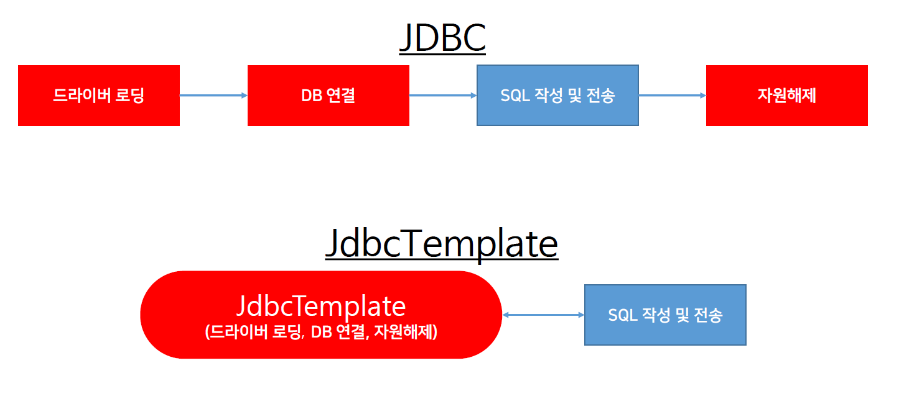
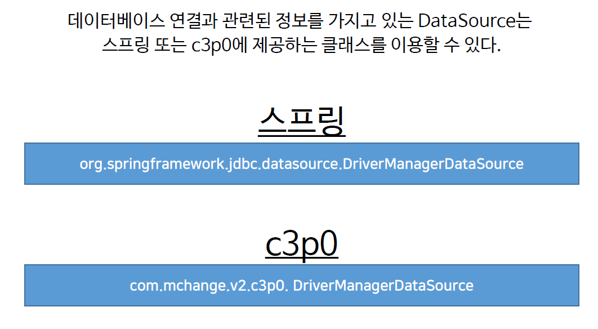

# ch22_JdbcTemplate

1. JdbcTemplate?

   * JDBC의 데이터베이스와 통신을 하기위해서 드라이버를 로드하고, 커넥션 객체를 구하고, 질의 응답을 하고, 사용했던 자원을 다 해제하는 작업을 통신할때마다 매번해주는 것을 해결하기위해서 만든 것이다. 
   * 이제 위의 작업과 같은것은 모두 spring frame work에게 맡기면 되고, 개발자는 query문 정도만 작성해주면 된다.

   

2. DataSource 클래스

   

   * 데이터베이스를 사용하기 위해서 경로, url, 계정 id, pw와 같은것을 갖고있는 객체라고 생각하면 된다. 즉, 그냥 데이터베이스 연결과 관련된 정보를 갖고있는 객체라고 생각하면 된다.

---

실습

우선 위의 것들을 사용하기 위해 pom.xml에 의존설정을 먼저해줘야한다.

`<dependencies>`에 다음과 같이 추가해준다.

```xml
	<repositories>
        <repository>
            <id>oracle</id>
            <name>ORACLE JDBC Repository</name>
            <url>http://maven.jahia.org/maven2</url>
        </repository>
    </repositories>	
...
		<!-- DB -->
		<dependency>
            <groupId>com.oracle</groupId>
            <artifactId>ojdbc6</artifactId>
            <version>12.1.0.2</version>
        </dependency>
        <dependency>
            <groupId>com.mchange</groupId>
            <artifactId>c3p0</artifactId>
            <version>0.9.5</version>
        </dependency>
        <dependency>
            <groupId>org.springframework</groupId>
            <artifactId>spring-jdbc</artifactId>
            <version>4.1.6.RELEASE</version>
        </dependency>
```

maven에는 oracle과는 라이센스가 좀 다르기때문에 위처럼 레퍼지토리를 추가해줘야한다.

이제 `MemberDAO`를 고쳐보자

*MemberDAO.java*

```java
...
@Repository
public class MemberDao implements IMemberDao {

	private String driver = "oracle.jdbc.driver.OracleDriver";
	private String url = "jdbc:oracle:thin:@localhost:1521:xe";
	private String userid = "nam";
	private String userpw = "nam";
	
	private DriverManagerDataSource dataSource;
	
	private JdbcTemplate template;
		
	public MemberDao() {
		
		// spring의 DataSource
//		dataSource = new DriverManagerDataSource();
//		dataSource.setDriverClassName(driver);
//		dataSource.setUrl(url);
//		dataSource.setUsername(userid);
//		dataSource.setPassword(userpw);
//		
		// c3po의 DataSource
//		dataSource = new DriverManagerDataSource();
//		dataSource.setDriverClass(driver);
//		dataSource.setJdbcUrl(url);
//		dataSource.setUser(userid);
//		dataSource.setPassword(userpw);
		
		dataSource = new ComboPooledDataSource();
		try {
			dataSource.setDriverClass(driver);
			dataSource.setJdbcUrl(url);
			dataSource.setUser(userid);
			dataSource.setPassword(userpw);
		} catch (PropertyVetoException e) {
			e.printStackTrace();
		}
		
		template = new JdbcTemplate();
		template.setDataSource(dataSource);
	}
		
```

코드를 보면 그아래에 메소드들에 1st, 2nd, 3rd등 방법이 여러가지인데 그중에 어떤것을 사용해도 상관없다.