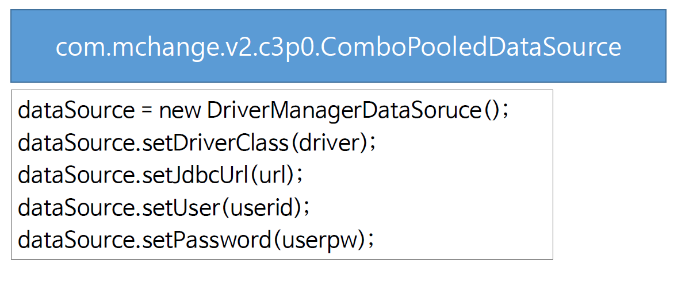
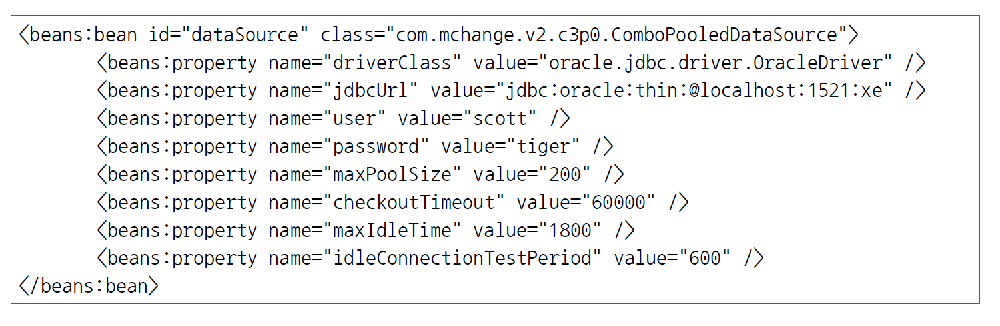

# ch23_ConnectionPool

1. 커넥션풀?

   - 데이터베이스 연결을 미리 준비해 놓고 사용하는 방법이다.

2. 사용법
   1. c3p0 모듈의 ComboPooledDataSource 이용법

      

      데이터를 `set`을 해서 데이터 소스를 이용할 수 있다

   2. 스프링 설정파일을 이용한 DataSource설정(servelet-context.xml)

      

      여기서 미리 객체를 생성하고, 이를 가져다가 사용하는 방법이다.

   3. 그 외로 Java파일로 `Bean` 객체를 만들어 주는 방법

3. 실제 사용예시

   1. ComboPooledDataSource 

      *MemberDAO.java*

      ```java
      import com.mchange.v2.c3p0.ComboPooledDataSource;
      
      @Repository
      public class MemberDao implements IMemberDao {
      
      	private String driver = "oracle.jdbc.driver.OracleDriver";
      	private String url = "jdbc:oracle:thin:@localhost:1521:xe";
      	private String userid = "nam";
      	private String userpw = "nam";
         
       //	private DriverManagerDataSource dataSource;
      	private ComboPooledDataSource dataSource;
      	
      	private JdbcTemplate template;
      	
      	
      	public MemberDao() {
              
              		// c3po의 DataSource (예외처리 필요x)
      //		dataSource = new DriverManagerDataSource();
      //		dataSource.setDriverClass(driver);
      //		dataSource.setJdbcUrl(url);
      //		dataSource.setUser(userid);
      //		dataSource.setPassword(userpw);
              
              	dataSource = new ComboPooledDataSource();
      		try {
      			dataSource.setDriverClass(driver);
      			dataSource.setJdbcUrl(url);
      			dataSource.setUser(userid);
      			dataSource.setPassword(userpw);
      		} catch (PropertyVetoException e) {
      			e.printStackTrace();
      		}
      		
      		template = new JdbcTemplate();
      		template.setDataSource(dataSource);
      	}
      ```

      `DriverManagerDataSource`에서 `DataSource`를 통해서 데이터를 `set`해줄 때와 다르게 `ComboPooledDataSource`를 사용할때에는 반드시 예외처리를 해줘야한다. 

   2. 스프링 설정파일 이용

      *servelet-context.xml*

      ```xml
      ...
      	<beans:bean id="dataSource" class="com.mchange.v2.c3p0.ComboPooledDataSource">
      		<beans:property name="driverClass" value="oracle.jdbc.driver.OracleDriver" />
      		<beans:property name="jdbcUrl" value="jdbc:oracle:thin:@localhost:1521:xe" />
      		<beans:property name="user" value="scott" />
      		<beans:property name="password" value="tiger" />
      		<beans:property name="maxPoolSize" value="200" />
      		<beans:property name="checkoutTimeout" value="60000" />
      		<beans:property name="maxIdleTime" value="1800" />
      		<beans:property name="idleConnectionTestPeriod" value="600" />
      	</beans:bean> 
      ...
      ```

      이렇게 미리 객체를 스프링 설정파일에서 만들도록 하고, 본 파일에서는 다음과 같이 `@Autowired`로 자동주입을 하도록해서 사용한다.

      *MemberDAO.java*

      ```java
      ...
          	@Autowired
      	public MemberDao(ComboPooledDataSource dataSource) {
      		this.template = new JdbcTemplate(dataSource);
      	}
      	
      ...
      ```

   3. Java파일로 만드는 방법

      *DBConfig.java*

      ```java
      import java.beans.PropertyVetoException;
      
      import org.springframework.context.annotation.Bean;
      import org.springframework.context.annotation.Configuration;
      
      import com.mchange.v2.c3p0.ComboPooledDataSource;
      
      @Configuration
      public class DBConfig {
      	// bean annotation사용
      	@Bean
      	public ComboPooledDataSource dataSource() throws PropertyVetoException {
      		ComboPooledDataSource dataSource = new ComboPooledDataSource();
      		
      		dataSource.setDriverClass("oracle.jdbc.driver.OracleDriver");
      		dataSource.setJdbcUrl("jdbc:oracle:thin:@localhost:1521:xe");
      		dataSource.setUser("scott");
      		dataSource.setPassword("tiger");
      		dataSource.setMaxPoolSize(200);
      		dataSource.setCheckoutTimeout(60000);
      		dataSource.setMaxIdleTime(1800);
      		dataSource.setIdleConnectionTestPeriod(600);
      		
      		return dataSource;
      	}	
      }
      ```

      이렇게 하면 2번째 방법과 실행되는 건 똑같으나 그냥 취향차이..